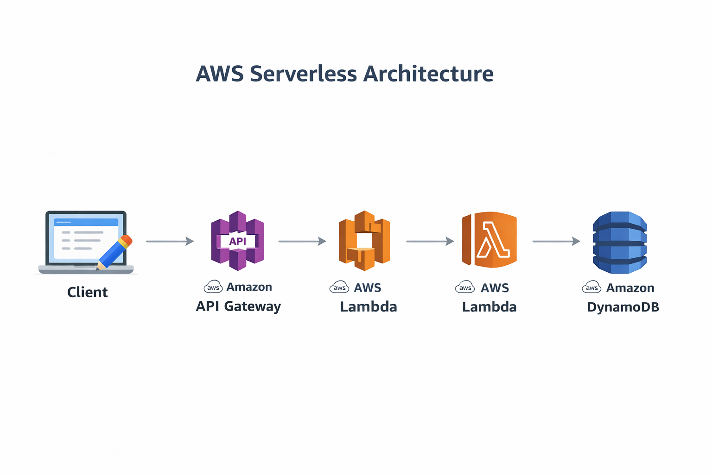

# 🚀 AWS Serverless Notes API

A fully serverless REST API built using AWS Lambda, Amazon API Gateway, and Amazon DynamoDB.

This project demonstrates modern cloud-native architecture with event-driven execution and managed services.

---

## 🏗 Architecture

Client → API Gateway → Lambda → DynamoDB

- API Gateway handles HTTP requests
- Lambda executes backend logic
- DynamoDB stores note data
- IAM role ensures secure access

---

## 🛠 AWS Services Used

- AWS Lambda (Python 3.12)
- Amazon API Gateway (REST API)
- Amazon DynamoDB (On-Demand mode)
- AWS IAM (Role-based access control)

---

## ⚙ Features

- Create Note (POST /notes)
- Retrieve All Notes (GET /notes)
- UUID-based unique note IDs
- Fully serverless (No EC2)

---

## 🔐 Security Best Practices

- IAM role attached to Lambda
- No hardcoded AWS credentials
- Principle of least privilege
- DynamoDB accessed via IAM role only

---

## 💰 Cost Optimization

- Used AWS Free Tier
- DynamoDB On-Demand billing
- Deleted all resources after testing

---

## 🧠 Learning Outcomes

- Understanding serverless architecture
- Working with event-driven Lambda functions
- Integrating API Gateway with Lambda
- Managing NoSQL databases (DynamoDB)
- IAM role configuration

---

### 1️⃣ Why choose Serverless over EC2?

Serverless architecture eliminates server management, auto-scales based on demand, and follows a pay-per-use pricing model. 

Compared to EC2:
- No infrastructure management
- Automatic scaling
- No idle cost
- Faster development and deployment

This makes serverless ideal for event-driven and microservice-based applications.

---

### 2️⃣ What is Lambda Cold Start?

A cold start occurs when AWS Lambda initializes a new execution environment to handle a request after a period of inactivity.

During cold start:
- Runtime is initialized
- Function code is loaded
- Dependencies are prepared

Cold starts add slight latency (usually milliseconds to a few hundred ms), but subsequent requests use warm environments.

---

### 3️⃣ Why DynamoDB instead of RDS?

DynamoDB was chosen because:

- It is fully serverless
- No connection management required
- Auto-scaling by default
- Millisecond latency
- Pay-per-request billing

RDS requires:
- Instance provisioning
- Connection pooling
- Scaling configuration

For simple key-value REST APIs, DynamoDB is more efficient and scalable.

---

### 4️⃣ What is an IAM Execution Role?

An IAM execution role is a role assumed by AWS Lambda to access other AWS services securely.

In this project:
- Lambda assumes the IAM role
- The role grants permission to access DynamoDB
- No AWS credentials are hardcoded in the code

This follows the Principle of Least Privilege and improves security.

---

### 5️⃣ How Does API Gateway Trigger Lambda?

API Gateway receives an HTTP request from the client.

With Lambda Proxy Integration enabled:
- API Gateway forwards the full request to Lambda
- Lambda processes the request
- Lambda returns a structured JSON response
- API Gateway sends the response back to the client

This creates a fully managed event-driven architecture.

---

## 📦 Deployment Steps

1. Create DynamoDB table
2. Create IAM role
3. Create Lambda function
4. Create REST API
5. Connect methods to Lambda
6. Deploy API

---

## 👨‍💻 Author

Vraj Patel  
Aspiring Cloud Solutions Architect
